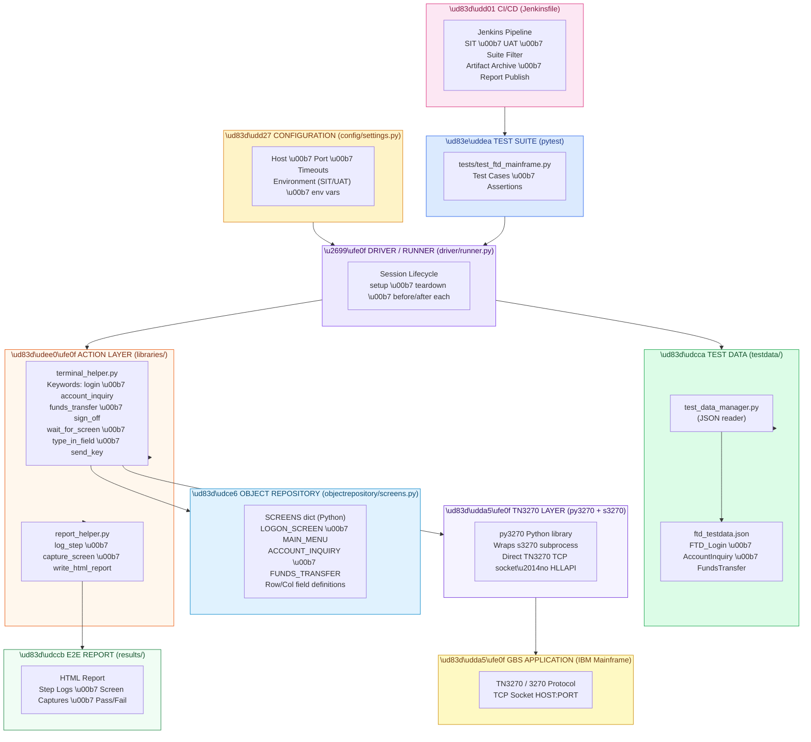
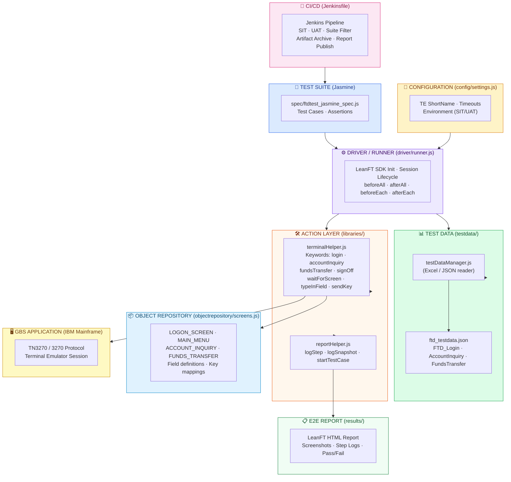

# New Architecture – BOA Mainframe Automation (Python / py3270)

> **Audience**: Client presentation – shows the full layer structure of the new Python/py3270 open-source framework that replaces the Jarvis / UFT / VBScript stack.

---

## Architecture Diagram



---

## Layer Descriptions

| Layer | File | Purpose |
|---|---|---|
| **Test Suite** | `tests/test_ftd_mainframe.py` | pytest test cases with `assert` statements — replaces Excel Test Suite |
| **Driver/Runner** | `driver/runner.py` | Central execution controller — manages py3270 session lifecycle |
| **Configuration** | `config/settings.py` | All environment-specific settings from env vars (host, port, timeouts) |
| **Test Data** | `testdata/ftd_testdata.json` | Test input and expected values (JSON, replaces Excel spreadsheets) |
| **Test Data Manager** | `testdata/test_data_manager.py` | `get(sheet, tc_id)` API for loading test rows |
| **Action Layer** | `libraries/terminal_helper.py` | Business keywords: `login`, `account_inquiry`, `funds_transfer`, etc. |
| **Report Helper** | `libraries/report_helper.py` | HTML report builder + console logging |
| **Object Repository** | `objectrepository/screens.py` | Plain Python dict — screen identifiers and field row/col definitions |
| **TN3270 Layer** | py3270 (3rd party) | Wraps `s3270` subprocess; opens direct TCP socket to mainframe |
| **Reporting** | `results/report.html` | Generated HTML report with step logs and screen captures |
| **CI/CD** | `Jenkinsfile` | Parameterised Jenkins pipeline (SIT/UAT, pytest filter, artifact archiving) |


---

## Architecture Diagram



---

## Layer Descriptions

| Layer | File | Purpose |
|---|---|---|
| **Test Suite** | `spec/ftdtest_jasmine_spec.js` | Test cases with Jasmine `describe/it` — replaces Excel Test Suite |
| **Driver/Runner** | `driver/runner.js` | Central execution controller — manages LeanFT SDK and TE session lifecycle |
| **Configuration** | `config/settings.js` | All environment-specific settings externalized (shortName, timeouts, env tag) |
| **Test Data** | `testdata/` | JSON data store with Excel-compatible reader — replaces Spreadsheet Testdata |
| **Action Layer** | `libraries/terminalHelper.js` | Reusable keyword functions for 3270 mainframe — replaces `.qfl` VBScript libraries |
| **Report Helper** | `libraries/reportHelper.js` | Wraps LeanFT Report SDK for structured step-level logging |
| **Object Repository** | `objectrepository/screens.js` | Centralized screen and field definitions — no proprietary UFT format |
| **E2E Report** | `results/` | LeanFT HTML report with screenshots, step logs, and pass/fail status |
| **CI/CD** | `Jenkinsfile` | Jenkins pipeline with SIT/UAT environment params and report publishing |

---

## Execution Flow

```
Jenkins Pipeline (Jenkinsfile)
  └─► Jasmine Test Suite
        └─► Driver/Runner.setup()           ← Init LeanFT + open TN3270 session
              └─► terminalHelper.login()    ← Logon screen keyword
                    └─► waitForScreen()     ← Screen resolved from Object Repository
                    └─► typeInField()       ← Field position from Object Repository
                    └─► sendKey("Enter")
              └─► terminalHelper.accountInquiry() / fundsTransfer()
                    └─► Reads test data from testDataManager
                    └─► Executes steps via TE keywords
                    └─► Captures screenshot via reportHelper
              └─► expect(actual).toBe(expected)  ← Jasmine assertion
              └─► reportHelper.logStep()          ← Written to LeanFT HTML report
        └─► Driver/Runner.teardown()         ← Sign off + cleanup
```
