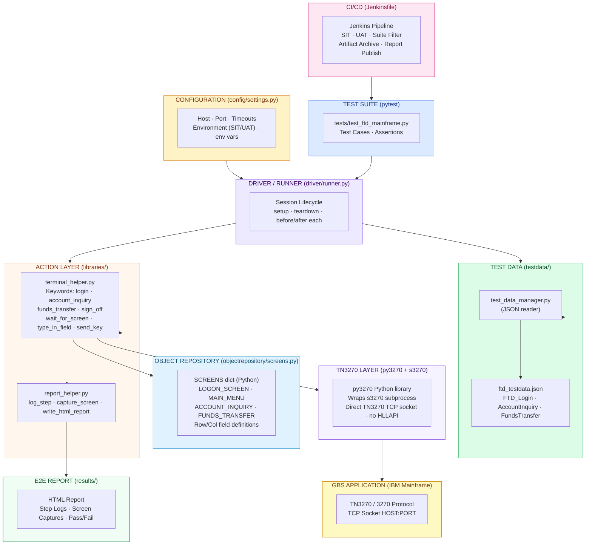

# New Architecture - BOA Mainframe Automation (Python / py3270)

> **Audience**: Client presentation - shows the full layer structure of the new Python/py3270 open-source framework that replaces the Jarvis / UFT / VBScript stack.

---

## Architecture Diagram



---

## Layer Descriptions

| Layer | File | Purpose |
|---|---|---|
| **Test Suite** | `tests/test_ftd_mainframe.py` | pytest test cases with `assert` statements - replaces Excel Test Suite |
| **Driver/Runner** | `driver/runner.py` | Central execution controller - manages py3270 session lifecycle |
| **Configuration** | `config/settings.py` | All environment-specific settings from env vars (host, port, timeouts) |
| **Test Data** | `testdata/ftd_testdata.json` | Test input and expected values (JSON, replaces Excel spreadsheets) |
| **Test Data Manager** | `testdata/test_data_manager.py` | `get(sheet, tc_id)` API for loading test rows |
| **Action Layer** | `libraries/terminal_helper.py` | Business keywords: `login`, `account_inquiry`, `funds_transfer`, etc. |
| **Report Helper** | `libraries/report_helper.py` | HTML report builder + console logging |
| **Object Repository** | `objectrepository/screens.py` | Plain Python dict - screen identifiers and field row/col definitions |
| **TN3270 Layer** | py3270 (3rd party) | Wraps `s3270` subprocess; opens direct TCP socket to mainframe |
| **Reporting** | `results/report.html` | Generated HTML report with step logs and screen captures |
| **CI/CD** | `Jenkinsfile` | Parameterised Jenkins pipeline (SIT/UAT, pytest filter, artifact archiving) |

---

## Execution Flow

```
Jenkins Pipeline (Jenkinsfile)
  └─► pytest Test Suite (tests/test_ftd_mainframe.py)
        └─► conftest.py - session fixture
              └─► driver/runner.py - open_session()     ← py3270 launches s3270 subprocess
                    └─► s3270 opens TN3270 TCP socket → HOST:PORT (IBM Mainframe)
              └─► terminal_helper.login()
                    └─► wait_for_screen("LOGON_SCREEN") ← identifier from screens.py
                    └─► type_in_field(row, col, value)  ← field position from screens.py
                    └─► send_key("Enter")
              └─► terminal_helper.account_inquiry() / funds_transfer()
                    └─► Test data loaded via test_data_manager from ftd_testdata.json
                    └─► Executes TN3270 keywords
                    └─► capture_screen() → report_helper logs screenshot
              └─► assert actual == expected             ← pytest assertion
              └─► report_helper.log_step()              ← Written to results/report.html
        └─► conftest.py - session teardown
              └─► driver/runner.py - close_session()    ← s3270 subprocess terminated
              └─► report_helper.write_html_report()     ← results/report.html generated
```