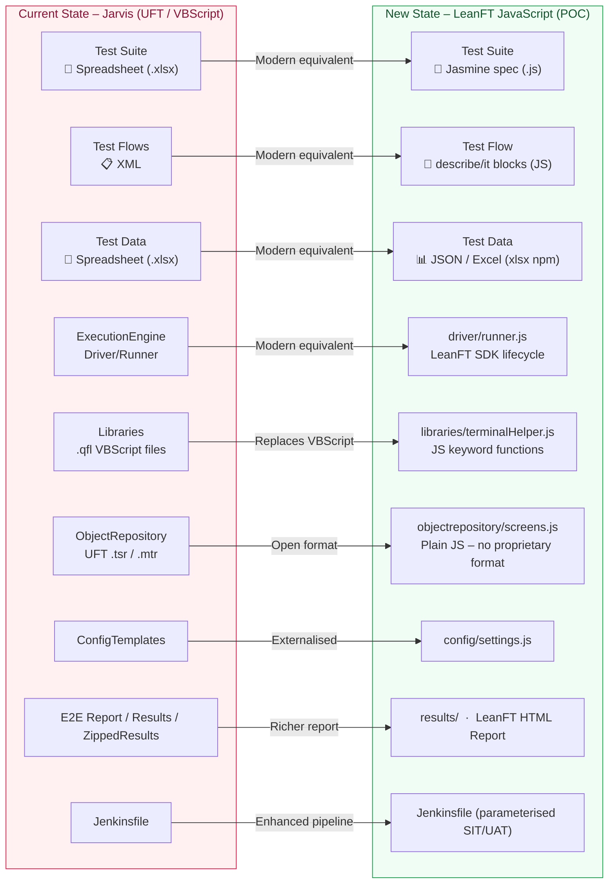

# Framework Comparison – Jarvis (Current) vs LeanFT JavaScript (New)

> **Audience**: Client presentation – shows a direct component-by-component mapping between the existing Jarvis framework and the new LeanFT/JavaScript POC, demonstrating continuity while eliminating the VBScript/UFT dependency.

---

## Side-by-Side Comparison Diagram

---

## Component Mapping Table

| # | Jarvis Component | Jarvis Technology | New Component | New Technology |
|---|---|---|---|---|
| 1 | Test Suite | Excel Spreadsheet (`.xlsx`) | `spec/ftdtest_jasmine_spec.js` | Jasmine (JavaScript) |
| 2 | Test Flows | XML | `describe` / `it` blocks | Native JavaScript structure |
| 3 | Test Data | Excel Spreadsheet (`.xlsx`) | `testdata/ftd_testdata.json` + `xlsx` npm | JSON / Excel via Node.js |
| 4 | Driver / ExecutionEngine | UFT proprietary runner | `driver/runner.js` | LeanFT SDK (JavaScript) |
| 5 | Libraries | `.qfl` VBScript files | `libraries/terminalHelper.js` | Plain JavaScript functions |
| 6 | Object Repository | UFT `.tsr` / `.mtr` (binary) | `objectrepository/screens.js` | Plain JavaScript object |
| 7 | ConfigTemplates | UFT config files | `config/settings.js` | Node.js module + env vars |
| 8 | E2E Report / Results | UFT HTML report | `results/` — LeanFT HTML Report | LeanFT Report SDK |
| 9 | Jenkinsfile | Basic pipeline | `Jenkinsfile` | Parameterised (SIT/UAT/filter) |

---

## Key Technology Differences

| Concern | Jarvis (Current) | LeanFT JavaScript (New) |
|---|---|---|
| **Language** | VBScript (deprecated) | JavaScript ES2020 (actively maintained) |
| **Tooling** | UFT (proprietary) | LeanFT / OpenText FTD (modern SDK) |
| **Test runner** | UFT built-in | Jasmine (open source, npm ecosystem) |
| **Async model** | Synchronous, sequential | `async/await` (non-blocking, faster) |
| **Object Repo format** | Binary UFT format | Plain JavaScript (readable, diffable in Git) |
| **Test data format** | Excel only | JSON (default) + Excel via `xlsx` package |
| **VBScript risk** | **HIGH** – VBScript is being phased out | **NONE** – JavaScript has long-term support |
| **CI/CD maturity** | Limited (Litmus POC incomplete) | Jenkins pipeline ready (SIT + UAT) |
| **Source control** | Limited visibility into binary files | Full Git diff visibility (all text files) |
| **Citrix support** | Dependent on UFT Citrix add-in | LeanFT Insight module (to be validated in pilot) |

---

## What is Retained from Jarvis

- ✅ Modular, layered architecture (same conceptual structure)
- ✅ Data-driven approach (test data separate from test logic)
- ✅ Keyword-driven action layer (reusable functions/keywords)
- ✅ Centralised Object Repository
- ✅ External configuration
- ✅ Jenkins-based CI/CD pipeline
- ✅ HTML test reports with step-level logging
- ✅ TN3270 mainframe application support (`leanft.sdk.te`)

## What Changes

- ❌ VBScript → ✅ JavaScript
- ❌ UFT proprietary runner → ✅ LeanFT SDK + Jasmine
- ❌ Binary object files → ✅ Plain JS (Git-friendly)
- ❌ XML Test Flows → ✅ Native JS `describe/it` structure
- ❌ Limited CI/CD → ✅ Parameterised Jenkins pipeline
