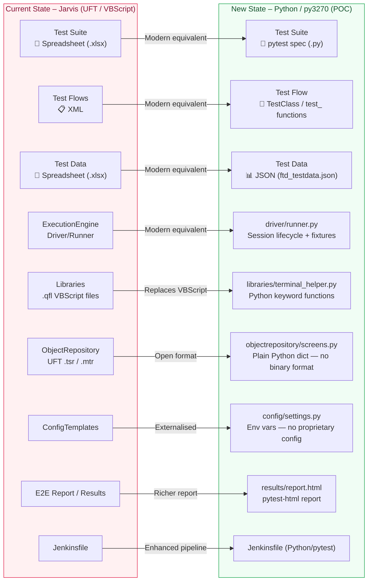

# Framework Comparison – Jarvis (Current) vs Python/py3270 (New)

> **Audience**: shows a direct component-by-component mapping between the existing Jarvis framework and the new open-source Python/py3270 POC, demonstrating continuity while eliminating the VBScript/UFT/LeanFT dependency entirely.

---

## Side-by-Side Comparison Diagram

---

## Component Mapping Table

| # | Jarvis Component | Jarvis Technology | New Component | New Technology |
|---|---|---|---|---|
| 1 | Test Suite | Excel Spreadsheet (`.xlsx`) | `tests/test_ftd_mainframe.py` | pytest (Python) |
| 2 | Test Flows | XML | `class Test…` / `def test_…` | Native Python class structure |
| 3 | Test Data | Excel Spreadsheet (`.xlsx`) | `testdata/ftd_testdata.json` | JSON via stdlib `json` module |
| 4 | Driver / ExecutionEngine | UFT proprietary runner | `driver/runner.py` | pytest fixtures + py3270 |
| 5 | Libraries | `.qfl` VBScript files | `libraries/terminal_helper.py` | Plain Python functions |
| 6 | Object Repository | UFT `.tsr` / `.mtr` (binary) | `objectrepository/screens.py` | Plain Python dict |
| 7 | ConfigTemplates | UFT config files | `config/settings.py` | Python + environment variables |
| 8 | E2E Report / Results | UFT HTML report | `results/report.html` | pytest-html (open source) |
| 9 | Jenkinsfile | Basic pipeline | `Jenkinsfile` | Parameterised (SIT/UAT/filter) |

---

## Key Technology Differences

| Concern | Jarvis (Current) | Python / py3270 (New) |
|---|---|---|
| **Language** | VBScript (deprecated) | Python 3.10+ (industry standard) |
| **Tooling** | UFT + LeanFT (proprietary, licensed) | py3270 + pytest (open source, free) |
| **Test runner** | UFT built-in | pytest (industry-standard, plugin ecosystem) |
| **TN3270 driver** | HLLAPI via emulator (UFT TE add-in) | Direct TN3270 TCP socket via s3270 binary |
| **Async model** | Synchronous, sequential | Synchronous (py3270 is blocking — safe for mainframe) |
| **Object Repo format** | Binary UFT format | Plain Python dict (readable, diffable in Git) |
| **Test data format** | Excel only | JSON (default); easily extended to Excel via openpyxl |
| **Licensing cost** | HIGH — UFT + LeanFT per-seat licenses | **ZERO** — all open source |
| **VBScript risk** | **HIGH** – VBScript is being phased out of Windows | **NONE** – Python has long-term support |
| **CI/CD maturity** | Limited (Litmus POC incomplete) | Jenkins pipeline ready (SIT + UAT) |
| **Source control** | Limited visibility into binary files | Full Git diff visibility (all text files) |

---

## What is Retained from Jarvis

- ✅ Modular, layered architecture (same conceptual structure)
- ✅ Data-driven approach (test data separate from test logic)
- ✅ Keyword-driven action layer (reusable functions/keywords)
- ✅ Centralised Object Repository
- ✅ External configuration
- ✅ Jenkins-based CI/CD pipeline
- ✅ HTML test reports with step-level logging
- ✅ TN3270 mainframe application support

## What Changes

- ❌ VBScript → ✅ Python
- ❌ UFT + LeanFT proprietary runner → ✅ py3270 + pytest (open source)
- ❌ Binary object files → ✅ Plain Python dict (Git-friendly)
- ❌ XML Test Flows → ✅ Native Python `class/def` structure
- ❌ HLLAPI emulator dependency → ✅ Direct TN3270 TCP socket (s3270)
- ❌ Per-seat licensing cost → ✅ Zero cost (all open source)
